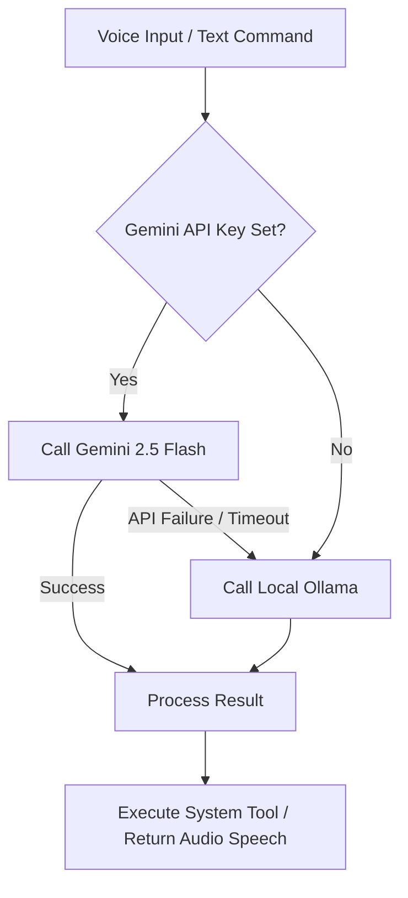

# 🐲 ShadowDragon Agent

ShadowDragon is a voice-activated hybrid AI assistant designed to run on Windows. It combines the power of cloud-based LLMs with local offline fallback capabilities, enabling hands-free system automation, voice conversation, and local execution.

Featuring a built-in Desktop Control Center Dashboard and a global hotkey, the assistant can run headless or as a desktop utility.

---

## 🌟 Key Features

- **🗣️ Voice Activation & Conversation**: Listens for the wake word (`"shadow"` or `"shadowdragon"`) using OpenAI's Whisper model, responding with natural, local Text-to-Speech (TTS).
- **⌨️ Global Manual Override Hotkey (`Alt + Shift + S`)**: Tap the global hotkey to trigger listening instantly, bypassing wake-word detection latency.
- **🖥️ Desktop Control Center (GUI Dashboard)**: A dark-themed desktop dashboard built with Tkinter that displays:
  - Real-time assistant states (Waiting, Listening, Thinking, Speaking, Idle).
  - A scrollable transcription & log history.
  - A live viewer displaying variables inside the persistent memory store.
  - Quick buttons to trigger manual listening, clear the console logs, or perform a clean system shutdown.
- **🧠 Hybrid Dual-Brain Architecture**:
  - **Primary**: **Gemini 2.5 Flash** (via high-speed API) for ultra-fast intent routing and agent logic.
  - **Fallback**: **Local Ollama Models** (`phi3:mini` for routing and `mistral` for agent tasks) when offline, if the API key is not set, or if API limits are reached.
- **🛡️ Secure System Automation**:
  - **Sandbox Terminal**: Scans chained terminal commands against a security blocklist (blocking `del`, `format`, `rmdir`, etc.) to prevent dangerous actions.
  - **App Launcher**: Launches registered local programs via Start Menu shortcuts with a high fuzzy matching confidence threshold (score $\ge 75$).
  - **Browser Controller**: Opens specific web URLs or performs search requests.
  - **Screen Reader (OCR)**: Captures screen sections and extracts text using Tesseract to answer visual queries.
- **🔊 Echo-Cancelled Local TTS**: Powered by Piper TTS using high-quality local voices (`en_US-john-medium`). Sound playing blocks synchronously using native Windows `winsound` commands, and automatically flushes the listener's audio queue right after speaking to completely eliminate microphone feedback loops.
- **💾 Persistent JSON Memory Store**: Saves key-value pairs (e.g., *"remember my project name is Atlas"*) atomically to prevent database corruption. Writes timestamps to `logs/chat_history.txt` on disk.

---

## 📂 Codebase Structure

```
ShadowDragon-Agent/
│
├── shadowdragon/               # Main application package
│   ├── ai/                     # AI agents and routing
│   │   ├── conversation_manager.py # Manages chat history state
│   │   ├── mistral_agent.py    # Main chatbot agent (Gemini -> Local Mistral)
│   │   └── phi3_router.py      # Intent classifier (Gemini -> Local Phi3)
│   │
│   ├── memory/                 # Persistent memory modules
│   │   └── memory_store.py     # Local JSON-based key-value store (atomic writing)
│   │
│   ├── tools/                  # Automation integrations
│   │   ├── app_launcher.py     # Launching native Windows apps (fuzzy matching)
│   │   ├── browser.py          # Browser navigation
│   │   ├── screen_tools.py     # Screen capture and OCR
│   │   └── terminal.py         # Shell command execution (command sandbox)
│   │
│   ├── voice/                  # Speech input and output
│   │   ├── listener.py         # Audio recorder & Whisper STT (self-healing stream)
│   │   └── speech.py           # Piper TTS synthesis & winsound synchronous playback
│   │
│   ├── config.py               # Constants, system prompts & paths (Tesseract fallback)
│   ├── gui.py                  # Control Center Tkinter GUI Dashboard
│   └── main.py                 # Core main loop, Win32 hotkey & orchestration
│
├── logs/                       # Conversation and audit logs
│   └── chat_history.txt        # Local text logs of assistant operations
│
├── .env.example                # Sample environment configuration
├── requirements.txt            # Python dependencies
├── SETUP.md                    # Detailed step-by-step setup guide
└── diagnose.py                 # Diagnostics tool to verify path/dependencies
```

---

## ⚡ Quick Start

For full installation details, see [SETUP.md](file:///e:/PROJECTS/ShadowDragon-Agent/SETUP.md).

### 1. Configure Environment Variables
Copy `.env.example` to `.env` in the project root:
```bash
copy .env.example .env
```
Open `.env` and fill in your Gemini API Key:
```env
GEMINI_API_KEY=your_actual_gemini_api_key
GEMINI_MODEL=gemini-2.5-flash
```

### 2. Verify System Configuration
Ensure system tools (FFmpeg, Tesseract OCR) are installed, and download Piper voice files into the `shadowdragon/` directory. Check details using:
```bash
python diagnose.py
```

### 3. Run ShadowDragon
Ensure your python virtual environment is activated and start the agent:
```bash
python -m shadowdragon.main
```
The application will launch the Tkinter GUI Dashboard. If a graphical interface is not supported on your terminal or display server, it will automatically fall back to console-only execution.

---

## 🛠️ Hybrid Architecture Detail

ShadowDragon handles reasoning dynamically:



- **Router**: The router (`Phi3Router`) classifies incoming queries using the system prompts in `config.py` to route them to specific APIs or tools.
- **Agent**: The agent (`MistralAgent`) processes conversational chats and generates sequential plans for executing system-level operations.
